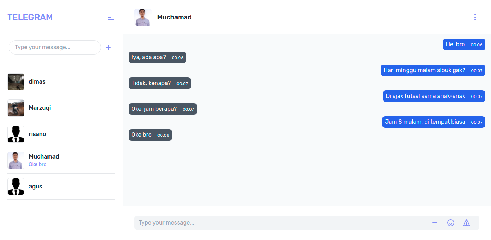

<!-- PROJECT LOGO -->
<br />
<p align="center">
  <a href="https://github.com/muchamadagush/realtime-chat">
    
  </a>

  <h3 align="center">Telegram Clone</h3>

  <p align="center">
    Telegram clone is a realtime chat application inspired by the popular social media application telegram, telegram clone has a private user chat feature and edit user profile.
    <br />
    <a href="https://github.com/muchamadagush/realtime-chat"><strong>Explore the docs »</strong></a>
    <br />
    <br />
    <a href="https://vehicle-rental.muchamadagushermawan.online/">View Demo</a>
    ·
    <a href="https://github.com/muchamadagush/realtime-chat">Report Bug</a>
    ·
    <a href="https://github.com/muchamadagush/realtime-chat">Request Feature</a>
  </p>
</p>

<!-- TABLE OF CONTENTS -->
<details open="open">
  <summary>Table of Contents</summary>
  <ol>
    <li>
      <a href="#about-the-project">About The Project</a>
        <ol>
            <li>
                <a href="#build-with">Build With</a>
            </li>
        </ol>
    </li>
    <li>
      <a href="#getting-started">Getting Started</a>
      <ol>
        <li>
          <a href="#installation">Installation</a>
        </li>
        <li>
          <a href="#prerequisites">Prerequisites</a>
        </li>
        <li>
          <a href="#related-project">Related Project</a>
        </li>
      </ol>
    </li>
    <li><a href="#screenshots">Screenshots</a></li>
    <li><a href="#contact">Contact</a></li>
  </ol>
</details>

## About The Project

<b>Telegram Clone</b> is a.

### Build With
* [JavaScript](https://www.javascript.com/)
* [Next Js](https://nextjs.org/)
* [Socket-io-client](https://www.npmjs.com/package/socket.io-client)


## Getting Started

### Prerequisites

This is an example of how to list things you need to use the software and how to install them.
* [Node Js](https://nodejs.org/en/download/)

### Installation

1. Clone These 2 Repos (Backend and Frontend)
```sh
git clone https://github.com/muchamadagush/realtime-chat
```
2. Go To Folder Repo
```sh
cd realtime-chat
```
3. Install Module
```sh
npm install
```
4. Add .env file at root folder project, and add following
```sh
REACT_APP_VERCEL_URL = [BACKEND_API]
```
5. Start website
```sh
npm run dev
```

### Related Project
* [`Frontend Telegram Clone`](https://github.com/muchamadagush/realtime-chat)
* [`Backend Telegram Clone`](https://github.com/muchamadagush/Backend-realtimeapp)

## Screenshots

<div align="center">
       
    
</div>
<div align="center">
       
    
</div>
<div align="center">
       
    
</div>
<div align="center">
       
</div>

## Contact
My Email : muchamadagush@gmail.com

Project Link: [https://github.com/muchamadagush/realtime-chat](https://github.com/muchamadagush/realtime-chat)
